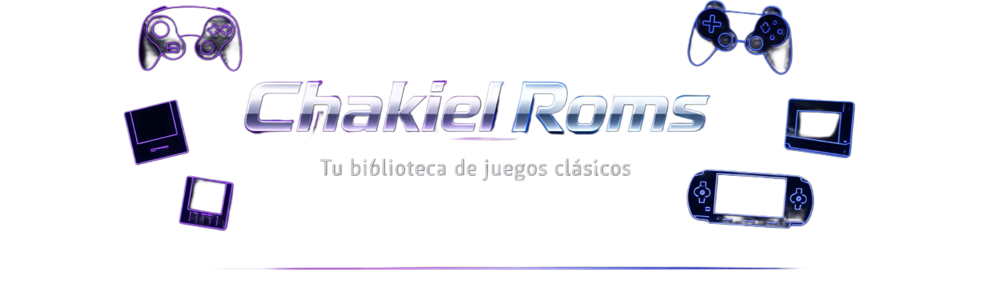

# Chakiel Roms

**Tu biblioteca definitiva de juegos clásicos para Android**

---

## ¿Qué es Chakiel Roms?

Chakiel Roms es una aplicación Android para los amantes de los videojuegos clásicos. Funciona como una biblioteca organizada donde podés explorar, descubrir y acceder a títulos de tus consolas favoritas, todo desde la palma de tu mano con una interfaz rápida y limpia.

Si creciste jugando GameCube, PlayStation 2, PSP, Nintendo DS o cualquier consola de generaciones pasadas, esta app es para vos.

---

## ¿Qué encontrarás adentro?

**Catálogo por consola**

Navegá una colección organizada por plataforma. Cada entrada incluye portada, nombre y toda la información que necesitás para identificar el título que buscás.

**Búsqueda global y por plataforma**

Escribís el nombre de un juego y la app lo encuentra al instante sin importar en qué consola esté. También podés buscar dentro de una plataforma específica cuando ya sabés dónde mirar.

**Favoritos**

Guardá los juegos que más te gustan con un toque largo. Tenés una sección dedicada solo para ellos, siempre a mano sin tener que buscarlos de nuevo.

**Videos destacados**

Desde la pantalla principal vas a encontrar videos seleccionados del canal de YouTube con guías, comparativas y recomendaciones para sacarle el máximo provecho a tu experiencia.

**Guía de emuladores**

La app incluye una sección con los mejores emuladores para cada consola, con descripción y enlace directo para descargarlos. Si no sabés cuál usar, acá encontrás la respuesta.

**Configuraciones recomendadas**

Tutoriales y guías para configurar rendimiento, controles, shaders y guardado rápido, pensados para que juegues sin fricciones desde el primer momento.

**Comunidad activa**

Accedé directamente a YouTube, Discord, Telegram y TikTok desde la app. Si tenés una duda, hay una comunidad entera lista para ayudarte.

---

## Interfaz pensada para móvil

La app tiene un diseño oscuro y moderno, cómodo para los ojos, con navegación simple a través del menú lateral y la barra inferior. Las imágenes cargan rápido y es compatible con cualquier Android actual.

---

## ¿Cómo empezar?

Descargá la APK desde el canal oficial, instalala habilitando orígenes desconocidos en tu Android y explorá el catálogo desde el menú lateral. Si es tu primera vez con emuladores, la sección de Videos Destacados tiene guías paso a paso para cada consola.

---

## Links oficiales

| Canal | Enlace |
|-------|--------|
| YouTube | [youtube.com/@Chakielzero2](https://www.youtube.com/@Chakielzero2) |
| Discord | [discord.gg/EmyFt8AN9V](https://discord.gg/EmyFt8AN9V) |
| Telegram | [t.me/ChakielZero](https://t.me/ChakielZero) |
| TikTok | [@chakielzero](https://www.tiktok.com/@chakielzero) |
| Web | [chakielroms.com](https://www.chakielroms.com) |

---

## Dudas o consultas

Cualquier pregunta sobre instalación o uso, el botón de ayuda dentro de la app te lleva directo a una guía en video. También podés unirte al Discord o Telegram donde la comunidad está siempre activa.

---

Hecho con dedicación por ChakielZero

